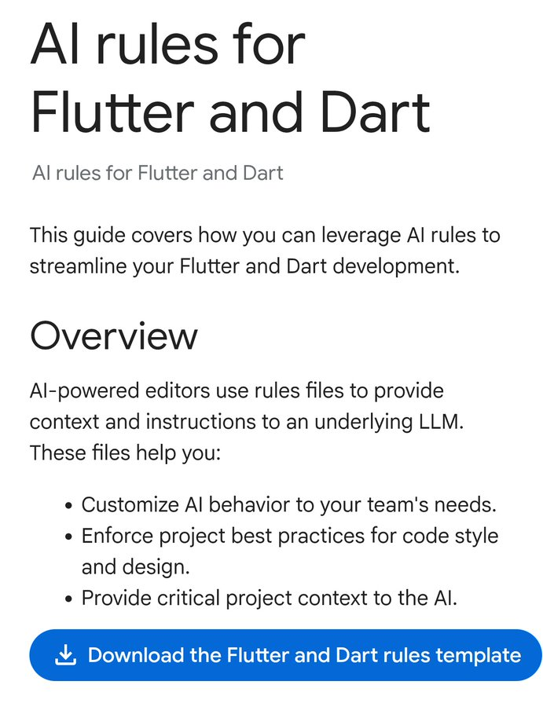

# Flutter 小聚 #28

---

# 小聚說明

- 主辦社群: **GDG Taipei**、**Flutter Taipei**
- 原則上一個月會舉辦一次，時間會在當月**最後一週的週二**
- 地點：**天攏書局 2F**
- 活動主要會分成
  - 當月 Flutter 大小事: 介紹當月 Flutter 相關的大小事
  - 開發者經驗分享: 分享與 Flutter 開發的相關內容，題目不限，可洽志工報名
  - Lightning Talk: 現場/活動事前表單報名，在場有任何想法，可洽志工報名
  - 活動任何問題都可以透過 **Slido** 發問
- 小聚任何行為都參照 GDG 台灣 行為準則 https://gdg.tw/code_of_conduct/
- 下次小聚時間：**2025/10/28**

---

---

---

# DevFest Taipei 2025 in 10/30

---

# DevFest Taipei 2025 CfP ~ 10/04

---

# Flutter Taipei 每月月報

---

# 上台分享可獲得一個 Pin 針 及 帽子

---

# [Slido](https://app.sli.do/event/foSqFPgdLXht2jtwsS2RQz)

---

# Flutter 九月大小事

## Rainer Fang

---

# Flutter & Dart AI Rule

- https://docs.flutter.dev/ai/ai-rules
  

---

# Riverpod 3.0

### 🚀 **新功能與改進**
* **離線持久化 (實驗性)：** 📦 讓 Provider 的狀態能夠儲存到資料庫中，即使離線也能存取。
* **異動 (實驗性)：** 🔄 提供一種新機制，讓介面能對**副作用**做出反應。
* **自動重試：** ⏳ 當 Provider 失敗時，會以**指數退避**的方式自動重新載入，提升穩定性。
* **`Ref.mounted`：** 🆕 新增類似 `BuildContext.mounted` 的屬性，用於檢查 `Ref` 物件是否處於活躍狀態。
* **泛型支援 (程式碼生成)：** 🤖 透過程式碼生成，Provider 現在可以定義**類型參數**，增加彈性。
* **暫停/恢復：** ⏸️ 使用 `ref.listen` 時，可以暫時**暫停或恢復**監聽。
  
---

### 🚨 **重要變動**
* **Provider 生命週期調整：** 🔧 對 Provider 的行為進行細微調整，以適應現代程式設計模式。
* **API 統一：** 🎯 整合了重複的介面，使公共 API 更一致、更簡潔。

---

## Riverpod 3.0 測試與安全

### 🧪 **新的測試工具**
* **`ProviderContainer.test`：** 🏗️ 一個新的測試工具，會自動建立並在測試結束後**銷毀** `ProviderContainer`。
* **`NotifierProvider.overrideWithBuild`：** 🎭 能夠只**模擬** `Notifier.build` 方法，而無需模擬整個 Notifier。
* **`Future/StreamProvider.overrideWithValue`：** ✨ 舊版中好用的**值覆寫**功能又回來了。
* **`WidgetTester.container`：** 🗃️ 透過這個輔助方法，可以在 widget 測試中輕鬆取得 `ProviderContainer`。

---

### 🛡️ **程式碼安全性**
* **靜態安全範圍：** 🔍 新增了**Lint 規則**，可以偵測出遺漏的 `override` 覆寫，從而提高程式碼的安全性與穩定性。

### ⚠️ **升級提醒**
* 這次更新包含**生命週期**的變動，可能在某些情況下會影響您的應用程式。
* 請務必參閱官方的**遷移指南**（migration page），並仔️細進行升級。

---

# Google Play 必須廢除這荒謬的測試程序！

發布應用程式前，需找到12位測試用戶，進行14天測試。Google認為這能「提高品質」。🤦‍♂️

---

## 現況與影響

- 結果：人們互相下載彼此的應用程式，14天內給予5星好評，即使是再爛的應用程式也獲得溢美之詞，只為符合規定。
- 那些平時無人問津的應用程式，突然獲得彷彿贏得諾貝爾獎般的評價。
- 這樣做根本沒有提升品質，反而讓情況更糟。👏👏

---

# 我的第一個新創失敗了 – 如果重來我會怎麼做

- 我花了一年半時間建立一個新創，但它失敗了。
- 想法是「智慧食譜規劃器」—一個應用程式，試圖將購物清單、餐點計畫和營養追蹤全部整合在一起。
- 我們認為這會為人們節省大量時間。實際上，大多數人要麼不太關心，要麼已經有更簡單的方法。

---

## 回顧與主要錯誤

- **MVP 過度建構**：沒有專注於一個殺手級功能（如購物清單），而是塞進了所有東西。
- **忽略真實行為**：人們不想改變日常習慣來使用我們的產品，摩擦力巨大。
- **誤認「沒有競爭」是綠燈**：我們以為找到了市場空白，實際上，這表示需求不強烈。
- **跳過早期回饋**：太晚才詢問用戶需求，大多數人只是聳聳肩說「不錯，但我可能永遠不會用」。
- **缺乏變現計畫**：我們想著之後再想辦法，結果是個壞主意。
- **行銷零關注**：我們沉迷於開發，卻很少分享我們正在做的東西。
- **沒有建立網絡**：沒有導師、顧問或合作夥伴，我們一直待在自己的小圈子裡。

---

## 如果重來，我會怎麼做？

- 我會讓一切更輕量化。不會投入多年時間在一個想法上。
- 我會快速提出概念、快速測試，看看它們是否能站穩腳跟。
- 現在我只會使用Notion、Figma、Canva、Feedblast、Slack等工具快速驗證想法，沒有什麼花俏的東西，只是足夠了解是否值得深入。

---

# Flutter 3.35.3 與最新的 Android Gradle / NDK (支援 16KB 記憶體頁面需求)

- 我目前正在更新 Android 應用程式以支援 16KB 記憶體頁面，並想分享我的發現和設定：

---

## 相關設定

- **AGP**: 8.12.0
- **Gradle**: 8.13
- **Kotlin**: 2.1.0 / **Java**: 21
- **compileSdk**: 36, **buildTools**: 36.0.0
- **NDK**: 28.0.12433566

---

## 需修改的路徑

- "android/build.gradle"
- "android/settings.gradle"
- "android/gradle/wrapper/gradle-wrapper.properties"
- "android/gradle.properties"
- "android/app/build.gradle"

---

## 重要注意事項

- 確保你的 Flutter channel 的 Gradle 外掛程式支援這些 AGP/Gradle 版本。
- 檢查你的模擬器（如果用於測試）是否支援 16KB 記憶體頁面。

---

# Flutter 全面的動畫與動作系統 (需要回饋)

- 大家好！我一直在開發一個名為 `motor` 的套件，現在快要發布 1.0.0 版本了。
- 我很想聽聽大家對於 API 最複雜的部分：動畫序列的意見。

---

## `motor` 套件的獨特賣點

- `motor` 的主要獨特賣點是它將傳統動畫 (如 Duration x Curve) 和基於物理的模擬 (如動態重新導向的彈簧) 統一在一個 API 中。
- 它功能非常強大，而且使用起來可以非常簡單。我現在已經將此功能引入到序列功能中。
- 相關說明可在 Readme 中找到，並有互動式範例網站。

---

## 尋求回饋

- 我非常感謝每一位查看並提供回饋的人，特別是關於如何簡化、哪些部分不直觀等等。

- Pub 連結: [https://pub.dev/packages/motor](https://pub.dev/packages/motor)
- 序列範例: [https://whynotmake-it.github.io/rivership/#/motor/sequence-animations](https://whynotmake-it.github.io/rivership/#/motor/sequence-animations)

---

# 7000 個免費圖示供你的應用程式使用

- Figma 連結: [https://www.figma.com/design/S7D5rxsHKwUg3I8TOLVtYo/7000-FREE-UI-ICONS--Community-?node-id=1-48280&t=9HVHZQd80rn1spDY-0](https://www.figma.com/design/S7D5rxsHKwUg3I8TOLVtYo/7000-FREE-UI-ICONS--Community-?node-id=1-48280&t=9HVHZQd80rn1spDY-0)

---

## 使用方式

- 之後再感謝我。
- 將它們下載為 SVG 格式，並使用 `SvgPicture` 套件來顯示。

---

# 我為 Flutter 製作了一個 Pixel Perfect 的 Liquid Glass Plugin 🤩

---

### **Flutter 的困境：缺乏原生感**

Flutter 雖然強大，但其 UI 元件有時無法完美複製原生平台的細微之處，這讓使用者感覺不夠「原生」。

當蘋果宣布 iOS 26 的「**Liquid Glass**」全新設計後，這個問題變得更加突出。Liquid Glass 包含了全新的材質與動畫效果，要完全在 Flutter 中重新實作這些細節是一項艱鉅的任務。

---

### **解決方案：混合式開發與平台視圖（Platform Views）**

前 Google Flutter 團隊成員 Viktor Lidholt 提出一個創新的解決方案：與其在 Flutter 中耗費時間複製原生效果，不如直接透過**平台視圖 (Platform Views)** 嵌入原生 Swift/SwiftUI 元件。

* **驚人的效能**：他開發了名為 [`cupertino_native`](https://pub.dev/packages/cupertino_native) 的概念驗證套件，並發現效能 surprisingly 地好。這是因為 Liquid Glass 的 UI 元素通常位於內容上方，避免了 Flutter 繪製內容於平台視圖上方的昂貴操作。

* **未來的混合式模式**：Lidholt 認為，最好的方式是採取**混合式開發**。對於工具列、開關等複雜元件使用原生平台視圖，而對於圖標等容易複製的元件則使用純 Flutter。

---

### **邀請社群協作**

`cupertino_native` 雖然有效，但僅是一個週末完成的概念驗證。Lidholt 預估，只要有合適的人手，不到一個月的時間就能使其達到可生產的品質。

他希望號召 Flutter 開發社群，在其開源專案 **Serverpod** 的支持下，一起將 `cupertino_native` 打造為一個實用的解決方案，讓 Flutter 應用程式能快速跟上原生平台的設計革新。

---

# HomeDepot 應用程式很爛，所以我做了一個新的 (與 Home Depot 無關)

## 日期: 2025-09-11T12:38:21.000Z

- 編輯：我確信許多 r/HomeDepot 的官方應用程式用戶會喜歡 THD Lite，但我不是員工，所以無法在那裡發文。
- 我想聊聊這個專案的開發過程。
- 這是我多年來一直想做的個人專案，因為我受夠了官方 Home Depot 應用程式 (以及幾乎所有零售應用程式，為什麼它們不能做好？)。

---

## 開發歷程與發現

- 我兩週前才開始這個專案，我對目前的進度感到非常自豪。
- 最初我認為效能差異不會太大，因為我以為緩慢是因為 Home Depot 的後端 (我的應用程式也必須使用它)。
- 然而，檢查官方應用程式的 HTTP 請求後，我發現整個應用程式只是一個網站的封裝器。這意味著進行搜尋查詢時，每次都會載入 CSS、腳本、字體，所有東西！
- 在使用 Home Depot 的 WIFI 時，這尤其糟糕。

---

## THD Lite 的解決方案

- 對於我的替代 HomeDepot 應用程式 (THD Lite)，我使用了 Flutter。
- 這表示我的應用程式不需要在執行時載入樣式資產，因為它們都與應用程式捆綁在一起。
- 搜尋產品只需要一個 API 請求，而不是數十個請求。

---

## 後端實作

- Home Depot 沒有公開的 API，它只是一個網站，我從中獲取資訊。
- 因此，我實作了一個後端作為應用程式和 Home Depot 網站之間的代理，它過濾掉所有標記，只返回數據。
- 由於我會在網路連接不佳的地方 (例如 Home Depot 的 WIFI) 使用這個應用程式，所以我使用 Protobuf (搭配 Connect RPC) 作為編碼方法 (而不是 JSON)，以盡可能減少頻寬使用。

---

## 結果與未來計畫

- 到目前為止，我對結果感到非常自豪，並且在店內已經切換使用我的應用程式了。
- 它還沒有發布，因為還有很多工作要做，但我對它感到非常興奮。
- Home Depot 沒有付錢給我，我仍在找工作，所以我沒有計畫添加線上訂單或專業服務台功能，因為這將花費太多時間實作。
- 但至少我可以在不等待數分鐘的情況下搜尋我的庫存了！