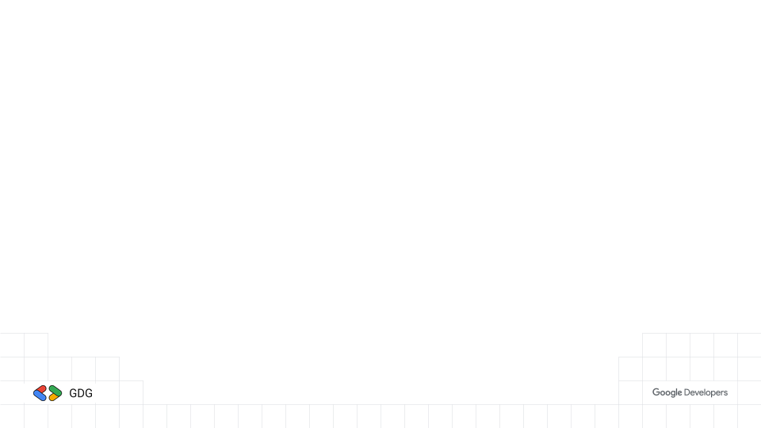
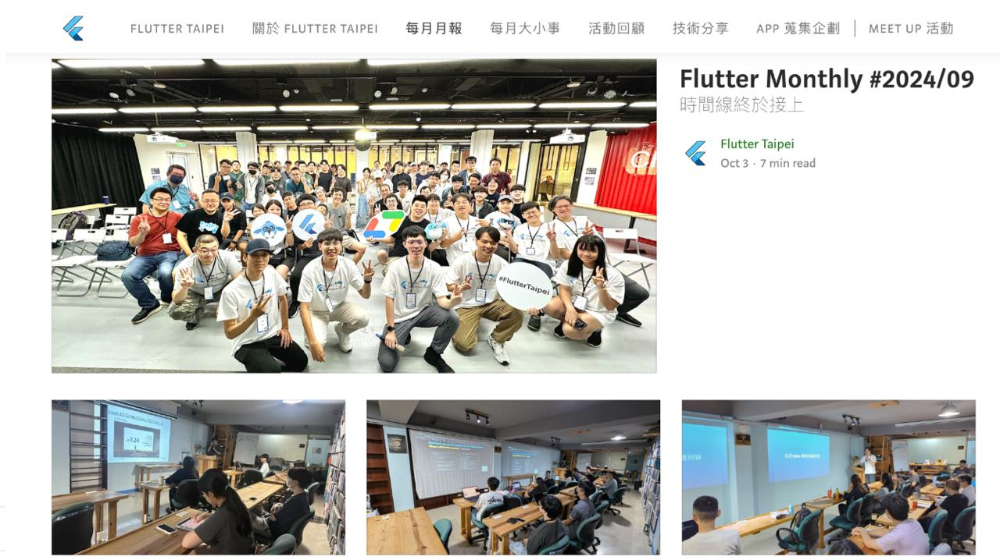

<style>
/* GDG brand — https://developers.google.com/community/gdg/brand-guidelines
   選擇器一律帶 section 前綴：Marp 會補上與 default theme 同級的高特異性前綴，
   少了 section 就會被 theme 的 `section :is(h1)` 蓋掉。 */

section {
  --h1-color: #1e1e1e;
  --heading-strong-color: #4285f4;
  --paginate-color: #5f6368;
  background: #ffffff;
  color: #1e1e1e;
  font-family: "Google Sans", "Product Sans", Roboto, "Noto Sans TC",
    "PingFang TC", "Microsoft JhengHei", sans-serif;
  font-size: 26px;
  line-height: 1.65;
  padding: 64px 72px;
}

section h1 {
  font-size: 52px;
  font-weight: 700;
  letter-spacing: -0.01em;
  margin-bottom: 28px;
  padding-bottom: 20px;
  background-image: linear-gradient(
    to right,
    #4285f4 0 25%, #ea4335 25% 50%, #f9ab00 50% 75%, #34a853 75% 100%
  );
  background-repeat: no-repeat;
  background-size: 200px 6px;
  background-position: left bottom;
}

section h2 { font-size: 34px; font-weight: 500; color: #4285f4; }
section h3 { font-size: 28px; font-weight: 400; color: #5f6368; }

section code {
  font-family: "Google Sans Mono", "Roboto Mono", "SF Mono", monospace;
  background: #f0f0f0;
  color: #1e1e1e;
  padding: 2px 8px;
  border-radius: 4px;
  font-size: 0.88em;
}
section a { color: #4285f4; text-underline-offset: 3px; }

section ul > li::marker { color: #4285f4; }
section ul ul > li::marker { color: #34a853; }
section ul ul { font-size: 0.92em; color: #3c4043; }
section li { margin: 0.3em 0; }

section blockquote {
  border-left: 5px solid #f9ab00;
  background: #fffdf5;
  margin: 20px 0;
  padding: 12px 22px;
  color: #1e1e1e;
  font-style: normal;
}

/* 封面：疊在 cover-v2.png 上，不要四色底線 */
section.cover h1 {
  background-image: none;
  padding-bottom: 0;
  font-size: 76px;
  margin-top: 120px;
}

/* 段落分隔頁：GDG 藍底 */
section.divider {
  --h1-color: #ffffff;
  --paginate-color: rgba(255, 255, 255, 0.8);
  background: #4285f4;
  color: #ffffff;
}
section.divider h1 {
  font-size: 64px;
  background-image: linear-gradient(
    to right,
    #ffffff 0 25%, #f9ab00 25% 50%, #c3ecf6 50% 75%, #34a853 75% 100%
  );
}
section.divider h2 { color: #ffffff; opacity: 0.92; }
</style>

<!-- _class: cover -->

# Flutter 小聚 #37

### 2026 / 08 ・ GDG Taipei × Flutter Taipei



---

# 小聚說明

- 主辦社群: **GDG Taipei**、**Flutter Taipei**
- 原則上一個月會舉辦一次，時間會在當月**最後一週的週二**
- 地點：**天攏書局 2F**
- 活動主要會分成
  - 當月 Flutter 大小事: 介紹當月 Flutter 相關的大小事
  - 開發者經驗分享: 分享與 Flutter 開發的相關內容，題目不限，可洽志工報名
  - Lightning Talk: 現場/活動事前表單報名，在場有任何想法，可洽志工報名
  - 活動任何問題都可以透過 **Slido** 發問
- 小聚任何行為都參照 GDG 台灣 行為準則 https://gdg.tw/code_of_conduct/

---


---


---

# Flutter Taipei 每月月報



---

# 上台分享可獲得一個 Pin 針 及 帽子


---

# 近期社群活動

- **無**（目前沒有已公告的近期活動）
- 近期已辦
  - **COSCUP 2026 - Google 開發者派對**（8/8–8/9，台灣科技大學）
    - GDG 專屬議程軌與攤位，主題涵蓋 Gemini / Gemma、Android、Google Cloud

---

# [Slido](https://qr.sli.do/7Wjw8b8UMxcGaUFAqKYsmY)


---

<!-- _class: divider -->

# Flutter 八月大小事

## Rainer Fang

---
# Flutter 3.47 ＋ Dart 3.13

> 兩者都在 2026/08/12 發布。

- **設計系統獨立**：`material_ui`、`cupertino_ui` 釋出 1.0
- **Impeller 成為桌面預設** renderer（macOS / Windows / Linux）
- **Widget Previews 進入 stable**
- Apple 平台最低版本拉高：**iOS 15**、**macOS 12**
- Dart 3.13：**primary constructors 進入 stable**
- 官方推 **Wasm**：8/17–8/21 辦了 WebAssembly Week

- 來源：[Flutter 3.47](https://flutter.dev/blog/whats-new-in-flutter-3-47)｜[Dart 3.13](https://dart.dev/blog/announcing-dart-3-13)
---

# material_ui / cupertino_ui 1.0

**把設計系統從 core SDK 搬到 pub.dev**

- 過去綁在 SDK 裡，只能跟著**季度**釋出；現在可以**每週**更新
- bug 修復與新功能不必再等下一個 stable
- 為「**風格中立**的 Flutter core widgets」鋪路

遷移只要一行：

```bash
dart fix --apply --code=migrate_design_widgets
```

自動把 `package:flutter/material.dart` 的 import 換成獨立套件。

- 來源：[官方 Medium](https://flutter.dev/blog/whats-new-in-flutter-3-47)

---

# 遷移時間表要注意

- core SDK 內的舊 design library 將在 **11 月 stable 正式 deprecate**
- 對生態系套件而言，這等同一次 **major version bump**
- 相依套件還沒跟上時，可用 `MaterialUiCompatibilityBridge` 先遷移自己的 app
- `flutter_localizations` 一併拆分出來
  - 改用 `GlobalMaterialLocalizations.delegates`，不用再手動列一堆 delegate

> 建議：**這個月就開始試 `dart fix`**，不要等 11 月。

---

# Impeller 成為桌面預設

- macOS、Windows、Linux 的**預設 renderer**
- shader 改在 **build 時期編譯**，消除首次動畫的 shader compilation jank
- macOS 另外預設開啟 **Wide Gamut Color**

暫時退回舊 renderer（**未來版本會移除**）：

- macOS：`Info.plist` 設 `FLTEnableImpeller` = `false`
- Windows：`main.cpp` 呼叫 `project.set_impeller_switch(...Disabled)`
- Linux：`my_application.cc` 呼叫 `fl_dart_project_set_enable_impeller(...)`

---

# Apple 平台：一次大清理

- 最低版本：iOS **13 → 15**、macOS **10.15 → 12**
  - 對齊秋天的 Xcode 27 / iOS 27 / macOS 27
- **UIScene 是強制的**：iOS 27 要求所有 UIKit app 採用
  - Flutter CLI 會自動處理；但**自訂 AppDelegate 或用到舊 lifecycle 的 plugin 要手動遷移**
- **Intel Mac 開始退場**：Intel 上 build 會出現警告，未來變成 error
  - 可用 `flutter config --enable-macos-arm64-only` 提前切 ARM64-only
- **SwiftPM**：前 100 大 iOS plugin 已有 **92 個**完成遷移
  - 沒遷移的 plugin pub.dev 分數會降低，最終會停止運作

---

# Widget Previews 進入 stable

- 不必 build 整個 app 就能即時預覽、迭代單一 widget
- 專案內建 `.widget_preview/` 快取，啟動更快
- 新的 `PreviewThemeData` API，支援 theme 疊加
- web 資產會自動同步，可預覽 web widget

> 這個功能適合拿來做 design system / 元件庫的日常開發。

---
# Dart 3.13：primary constructors

- **primary constructors 進入 stable**（3.12 還是實驗性）

```dart
class Point(final int x, final int y);
```

- 一行取代「欄位宣告 + 建構式參數」的樣板程式碼
- 建構式可用 `new` / `factory`，空 body 直接用 `;` 收尾
- 附 **6 個新 lint** 與 **4 個 IDE refactoring** 協助遷移
  - 如 `use_declaring_parameters`、`unnecessary_primary_constructor_body`

- 來源：[Announcing Dart 3.13](https://dart.dev/blog/announcing-dart-3-13)｜[設計取捨](https://dart.dev/blog/bringing-primary-constructors-to-dart)
---
# Dart 3.13：其他重點

- **native library tree-shaking**
  - `@RecordUse()` + `package:record_use`，只保留真正被呼叫的 native symbol
  - binary 明顯縮小，完全沒用到的 native library 可整包省略
- **Wasm deferred loading**（preview）
  - `dart compile wasm -O2 --enable-deferred-loading`
- **formatter 行為變更**（僅語言版本 3.13+ 生效）
  - import 區塊之間自動插入空行
  - method chain 的換行啟發式調整
- 舊 web library（`dart:html`、`package:js`）不支援 dart2wasm
  - 改用 `package:web`、`dart:js_interop`
---
# Wasm Week：實測數據

> 8/17–8/21，官方推動大家把 web app 編成 WebAssembly。

- 相對 JS 編譯（Chrome 151 / M4 Pro / 200 animated nodes）
  - frame time **快 2 倍**（17.4ms vs 34.5ms），穩定 60 FPS
  - widget building **快 2.5 倍**，抖動小 **3 倍以上**
  - bundle 只大 **5% 以內**
- **58% 的現有 web app 零改動**就能編成 Wasm
- `dart:html` / `dart:js` → `package:web` / `dart:js_interop`
- server 要設 `COEP: credentialless`、`COOP: same-origin`

- 來源：[Wasm Week](https://flutter.dev/blog/try-flutter-web-with-webassembly-week)
---
# Desktop Windowing API

> 在 **main channel**，需 `flutter config --enable-windowing`，仍是 experimental。

- 五種 window 類型：regular / dialog / tooltip / popup / satellite
  - 可階層巢狀，跨平台行為一致
- 主要 API：`WindowController`、`DialogWindowController`、`Window`、`WindowScope`

```dart
final controller = WindowController(
  title: 'My Application',
  size: const Size(800, 600),
);
```

- `showDialog` / `showMenu` / `Tooltip` 的整合還在規劃中

- 來源：[Desktop Windowing APIs](https://flutter.dev/blog/desktop-windowing-apis)
---
# Desktop：flavors 與文字渲染

- **Windows / Linux 開始支援 flavors**

```yaml
flutter:
  assets:
    - path: assets/flavor_a/images
      flavors:
        - flavor_a
```

- 文字渲染改用 **SDF**（macOS / Linux / Windows），字更利、曲線更乾淨
- 可從 platform controller 取 `windowHandle` 拿原生指標（HWND / NSWindow / GtkWindow）
---
# AI 與 Agent 相關

- **多 agent 開發團隊**（8/20）
  - 在 Antigravity 裡跑 architect / tester / coder 分工
  - 以 TDD 方式把 Python library 移植成 idiomatic 的 Dart package
- **async A2UI**（8/13）
  - 預先產生並快取 A2UI message，消除 generative UI 的啟動延遲
- Flutter 3.47 內的 `genui` **0.10.0**
  - 新增 `a2ui_core`，支援 client-side function

- 來源：[multi-agent dev teams](https://flutter.dev/blog/building-multi-agent-dev-teams)｜[async A2UI](https://flutter.dev/blog/speeding-up-generative-ui-with-async-a2ui)
---

# Android 依賴矩陣

Flutter 3.47 驗證過的組合：

- Java **17**（最低）
- Kotlin Gradle Plugin **2.4.0**
- Android Gradle Plugin **9.1.0**
- Gradle **9.3.1**

預設 API level：

- `flutter.compileSdkVersion` / `flutter.targetSdkVersion`：**API 36**
- `flutter.minSdkVersion`：**API 24**

另有內建 Kotlin Gradle plugin 的[遷移指引](https://docs.flutter.dev/release/breaking-changes/migrate-to-built-in-kotlin)。

---

# 框架細節修補

- **無障礙**
  - Android 高對比 / 反色偵測：`MediaQueryData.highContrast`、`invertColors`
  - `Text.rich` 巢狀 span 的 semantics 順序終於對齊版面順序
- **文字選取**
  - 小幅捲動時 selection handle 不再亂跳、不再蓋住 context menu
  - 修掉 `SelectableRegion` 在空 scrollable 裡的 crash
- **Widget**
  - `ImageIcon` 的 `useOriginalColors`、`AnimatedCrossFade` 的 clip behavior
  - `ImageStreamListener` 可直接接收 image stream 錯誤

---
# 這個月該做的事

1. `flutter upgrade` 升到 **3.47**（含 Dart **3.13**）
2. 跑 `dart fix --apply --code=migrate_design_widgets`，**先試 material_ui 遷移**
3. 檢查 Apple 專案：iOS 15 / macOS 12 最低版本、**UIScene**、自訂 AppDelegate
4. web 專案試跑 `flutter build web --wasm`，順手把 `dart:html` 換掉
5. 桌面 app 實測 Impeller，確認沒有渲染回歸
6. 盤點相依 plugin 的 **SwiftPM** 遷移狀況

> 11 月 stable 會正式 deprecate 舊 design library，**現在動比較不痛**。
---

# Q & A


