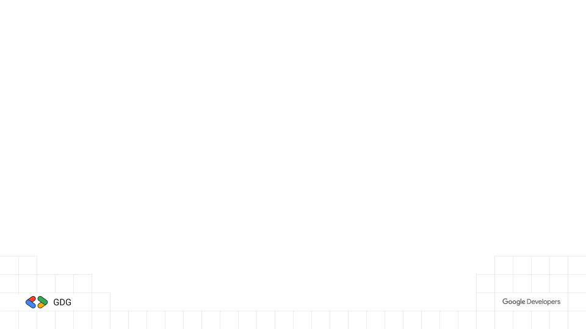
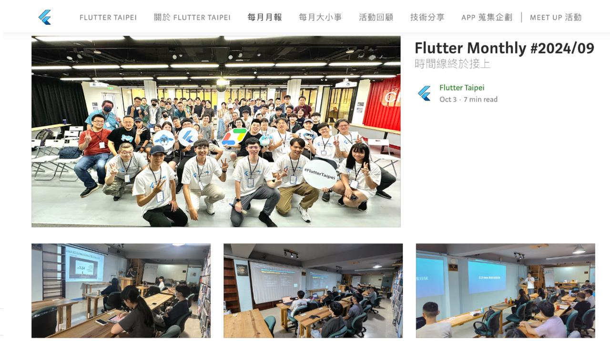
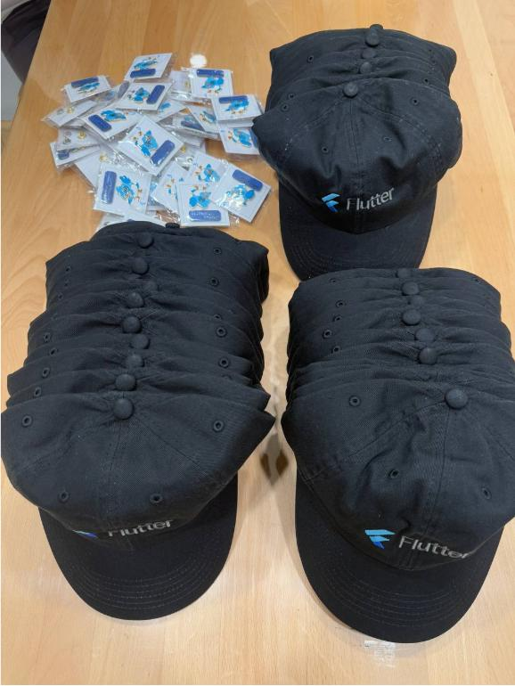
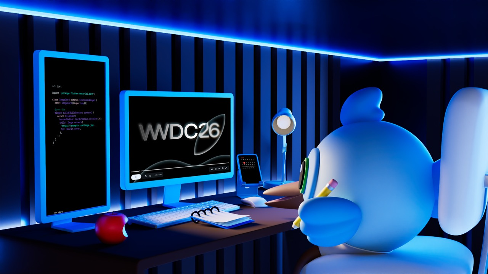
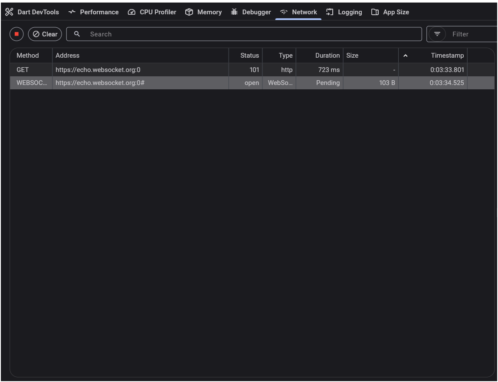
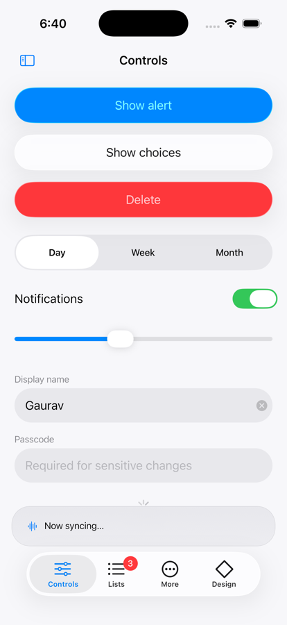
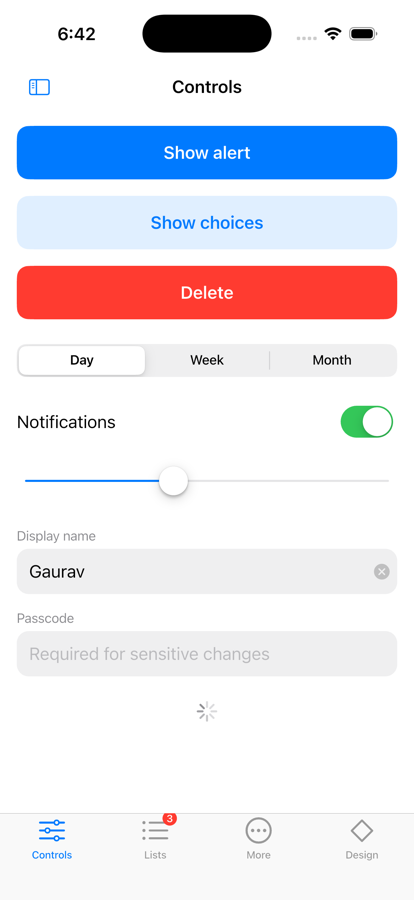

<style>
/* GDG brand — https://developers.google.com/community/gdg/brand-guidelines
   選擇器一律帶 section 前綴：Marp 會補上與 default theme 同級的高特異性前綴，
   少了 section 就會被 theme 的 `section :is(h1)` 蓋掉。 */

section {
  --h1-color: #1e1e1e;
  --heading-strong-color: #4285f4;
  --paginate-color: #5f6368;
  background: #ffffff;
  color: #1e1e1e;
  font-family: "Google Sans", "Product Sans", Roboto, "Noto Sans TC",
    "PingFang TC", "Microsoft JhengHei", sans-serif;
  font-size: 26px;
  line-height: 1.65;
  padding: 64px 72px;
}

section h1 {
  font-size: 52px;
  font-weight: 700;
  letter-spacing: -0.01em;
  margin-bottom: 28px;
  padding-bottom: 20px;
  background-image: linear-gradient(
    to right,
    #4285f4 0 25%, #ea4335 25% 50%, #f9ab00 50% 75%, #34a853 75% 100%
  );
  background-repeat: no-repeat;
  background-size: 200px 6px;
  background-position: left bottom;
}

section h2 { font-size: 34px; font-weight: 500; color: #4285f4; }
section h3 { font-size: 28px; font-weight: 400; color: #5f6368; }

section code {
  font-family: "Google Sans Mono", "Roboto Mono", "SF Mono", monospace;
  background: #f0f0f0;
  color: #1e1e1e;
  padding: 2px 8px;
  border-radius: 4px;
  font-size: 0.88em;
}
section a { color: #4285f4; text-underline-offset: 3px; }

section ul > li::marker { color: #4285f4; }
section ul ul > li::marker { color: #34a853; }
section ul ul { font-size: 0.92em; color: #3c4043; }
section li { margin: 0.3em 0; }

section blockquote {
  border-left: 5px solid #f9ab00;
  background: #fffdf5;
  margin: 20px 0;
  padding: 12px 22px;
  color: #1e1e1e;
  font-style: normal;
}

/* 封面：疊在 cover-v2.png 上，不要四色底線 */
section.cover h1 {
  background-image: none;
  padding-bottom: 0;
  font-size: 76px;
  margin-top: 120px;
}

/* 段落分隔頁：GDG 藍底 */
section.divider {
  --h1-color: #ffffff;
  --paginate-color: rgba(255, 255, 255, 0.8);
  background: #4285f4;
  color: #ffffff;
}
section.divider h1 {
  font-size: 64px;
  background-image: linear-gradient(
    to right,
    #ffffff 0 25%, #f9ab00 25% 50%, #c3ecf6 50% 75%, #34a853 75% 100%
  );
}
section.divider h2 { color: #ffffff; opacity: 0.92; }
</style>

<!-- _class: cover -->

# Flutter 小聚 #38

### 2026 / 09 ・ GDG Taipei × Flutter Taipei



---

# 小聚說明

- 主辦社群: **GDG Taipei**、**Flutter Taipei**
- 原則上一個月會舉辦一次，時間會在當月**最後一週的週二**
- 地點：**天攏書局 2F**
- 活動主要會分成
  - 當月 Flutter 大小事: 介紹當月 Flutter 相關的大小事
  - 開發者經驗分享: 分享與 Flutter 開發的相關內容，題目不限，可洽志工報名
  - Lightning Talk: 現場/活動事前表單報名，在場有任何想法，可洽志工報名
  - 活動任何問題都可以透過 **Slido** 發問
- 小聚任何行為都參照 GDG 台灣 行為準則 https://gdg.tw/code_of_conduct/

---


---


---

# Flutter Taipei 每月月報



---

# 上台分享可獲得一個 Pin 針 及 帽子



---


# 近期社群活動｜GDG Taipei

- **DevFest Taipei 2026**
  - 12/13（日）[活動頁](https://gdg.community.dev/events/details/google-gdg-taipei-presents-devfest-taipei-2026/cohost-gdg-taipei)
- 近期已辦
  - GDG 2026 / 09 月會：**WebMCP** — 讓 AI 知道你的網站可以怎麼操作（9/17）
  - Kotlin 15 歲生日蛋糕派對（8/18）
- GDG Cloud Taipei：**無**（目前沒有已公告的近期活動）

---

# [Slido](https://qr.sli.do/msHPor1mdpYPYvUfMyDdpf)


---

<!-- _class: divider -->

# Flutter 九月大小事

## Rainer Fang

---

# 九月重點一覽

- **iOS 27 / Xcode 27 正式版**（9/14）：UIScene 強制、Xcode 只剩 Apple Silicon
- **iPhone Duo** 發表（9/9）：Flutter 還拿不到摺疊資訊，官方正在拆工作
- Flutter **3.47.2 → 3.47.5** 四個 hotfix，多數跟 Xcode 27 / iOS 27 有關
- Dart **`skills` CLI 1.0**：套件可以直接附 AI agent skills
- **Serverpod 4**：全端 hot reload、embedded Postgres、offline sync
- **Android 17 QPR1**：新 API 只給 Pixel、不進 AOSP
- 社群套件：同一份 code 依 OS 版本渲染 **Liquid Glass** 或 **M3 Expressive**

---

# iOS 27 / Xcode 27 正式上線

> Apple 在 **2026/09/14** 釋出 iOS 27、macOS 27 與 Xcode 27。

- **UIScene lifecycle 強制**：用 iOS 27 SDK build、沒採用 UIScene 的 UIKit app **直接無法啟動**
- Flutter **3.41+** 會自動遷移未改過的 `AppDelegate`；**自訂 AppDelegate、add-to-app 要手動遷移**
- **Xcode 27 只能在 Apple Silicon Mac 上執行**，還在用 Intel Mac build 的環境要換機器
- Flutter 最低 iOS 版本已從 **13 拉到 15**（3.47 起）

- 來源：[flutter/website#13872](https://github.com/flutter/website/pull/13872)｜[VGV：WWDC 2026 through a Flutter lens](https://verygood.ventures/blog/wwdc-2026-through-a-flutter-lens/)

---

# iOS Day 0 怎麼做到的



- WWDC 145+ 場 session 交給 **Gemini 分類**
- webview 點擊失效：純 Swift 重現，Apple 在 **iOS 26.4** 修掉
- Dart 搬回 **platform thread**，手勢更穩
- UIScene 從 iOS 18.4 警告就開工，**3.41** 完成

- 來源：[官方 blog（8/25）](https://flutter.dev/blog/how-flutter-stays-ahead-of-ios-releases)

---

# iPhone Duo：現況


> 9/9 發表、**10/23 出貨**，要 **Xcode 27.1** 才能開發測試。

- `MediaQuery.displayFeatures` 在 iOS **永遠是空的**（文件寫明只有 Android 會填）
- 拿不到摺疊狀態、摺痕位置、hinge 角度
- 版面本身沒問題：用 `LayoutBuilder` / `MediaQuery.sizeOf` 的畫面會自動 reflow

- 來源：[Apple Newsroom](https://www.apple.com/newsroom/2026/09/apple-unveils-iphone-duo/)｜[Flutter on iPhone Duo](https://iphoneduosupport.com/frameworks/flutter/)

---

# iPhone Duo：官方在做什麼

- Flutter iOS 團隊 9/19 起開了 **十幾張 `[iPhone Duo]` issue**（P2、`team-ios`）
  - `onHingeChange`、reserved region 變動通知、半摺時避開摺痕
  - 支援 Apple 新的 `ArrangementView`（標了 `cupertino_ui`）
- `displayFeatures` 的 API 要改：reserved region 的 active / inactive 不適合塞進 `DisplayFeatureState`
- 社群 PR [#193025](https://github.com/flutter/flutter/pull/193025) 已送出（draft，等 CI 升 Xcode 27.1）

**等官方之前：** [`foldable`](https://pub.dev/packages/foldable) 套件用 platform channel 提供 hinge 角度與摺痕區域

- 來源：[flutter/flutter#192515](https://github.com/flutter/flutter/issues/192515)｜[#193059](https://github.com/flutter/flutter/issues/193059)

---

# iPhone Duo：現在就該檢查的地方

- 不要在 `State` 裡快取螢幕尺寸，改在 build 時用 `MediaQuery.sizeOf(context)`
- inner display 會**忽略 `setPreferredOrientations`**
- safe area **左右不對稱**，不要用 `EdgeInsets.symmetric(horizontal:)`
- Split View 下 app 是 `AppLifecycleState.inactive` 但**畫面仍然看得到**，別在 inactive 暫停
- 固定 16:9 的內容在 1.42:1 的 inner display 會有黑邊

- 來源：[Flutter on iPhone Duo](https://iphoneduosupport.com/frameworks/flutter/)

---

# Flutter 3.47 hotfix 整理

| 版本 | 日期 | 值得注意的修正 |
|---|---|---|
| 3.47.2 | 8/27 | Xcode 27 下 add-to-app SwiftPM build 失敗、Linux touch memory leak、**libpng 安全性更新** |
| 3.47.3 | 9/09 | `Actions.handler` 永遠回傳 null、PowerVR B 系列 GPU Impeller 異常 |
| 3.47.4 | 9/11 | **Xcode 27 debug 白畫面卡數分鐘**、native assets 上架 App Store 被拒 |
| 3.47.5 | 9/18 | **iOS 27 實機 debug 偶發 crash**、Widget Previewer crash |

> 要跟上 iOS 27，**至少升到 3.47.5**。

- 來源：[Flutter CHANGELOG](https://github.com/flutter/flutter/blob/stable/CHANGELOG.md)

---

# Dart skills CLI 1.0


> 原本由 Serverpod 開發，現在由 **Dart 團隊維護**（9/8）。

- 套件作者把 **AI agent skills 跟著套件發**，版本自然對齊
- 不用為了 `npx skills` 裝 Node.js

```bash
dart run skills@ get
dart run skills@ add <git-url>
```

- 已附 skills：**Jaspr**、**Serverpod**、**Flutter Scene**、**GenUI**

---

# 套件作者：怎麼附 skills

- 在 repo 根目錄放 `skills/`，子目錄用 **套件名當前綴**避免撞名
- 每個 skill 一份 `SKILL.md`，沿用標準 Agent Skills 格式

```
my_package/
├── lib/
├── skills/
│   └── my_package-error-handling/
│       └── SKILL.md
└── pubspec.yaml
```

- 來源：[Skills CLI 1.0](https://dart.dev/blog/skills-cli-1-0-bundle-and-distribute-ai-agent-skills-for-your-packages)

---

# Serverpod 4


> 9/14 釋出，r/FlutterDev 本月熱門。

- **全端 hot reload**：`serverpod start` 管 server、DB、web、app
- **Embedded Postgres**：本機不用 Docker
- **Offline sync（實驗性）**：`database: sync`，SQLite ↔ Postgres
- 內建 agent skills 與 **MCP server**
- **Serverpod Cloud**：`serverpod deploy`

- 來源：[Serverpod 4](https://serverpod.dev/blog/serverpod-4)

---

# Full-stack Dart 實戰：GenLatte


> 官方咖啡攤 app 後端從 Node.js 改成 Dart（9/22）。

- model 拆成**不依賴 Flutter** 的 package，前後端共用
- **15+ 個 Cloud Run service → 1 個** function
- `freezed` sealed class + `switch`，全程 **type-safe**
- server 帳單降到**原本的一小部分**

- 來源：[官方 blog](https://flutter.dev/blog/converted-genlatte-fullstack-dart)

---

# GSoC 2026 成果



> Dart / Flutter 第 7 年參加，近 100 份提案（9/15）。

- **DevTools Network 支援 WebSocket**（右圖）
- **FFIgen 實驗性支援 C++** class binding
- DevTools 可安全檢視 `Pointer<X>` 的 native memory
- `webcrypto` Android 改用 **JCA**，可省 BoringSSL 體積

- 來源：[GSoC 2026 results](https://dart.dev/blog/google-summer-of-code-2026-results)

---

# Android 17 QPR1：新 API 不進 AOSP

> 9/15 推出，GrapheneOS 指出這是 **Android 3.x（Honeycomb）以來第一次**。

- QPR1 帶來 **API 37.1** 的新 API（例如新的 `android.hardware.hid` 套件）
- 這些 API **目前只有 Pixel 有**，原始碼沒有釋出到 AOSP
- 其他 OEM 要等 **12 月的 QPR2** 才拿得到，部分安全性修補也一樣
- r/FlutterDev、Hacker News 都在討論 Android 走向封閉

---

# Android 17 QPR1：對 app 開發者的影響

- 同樣是 Android 17，**Pixel 和其他品牌的可用 API 不一樣**，碎片化更明顯
- 用 37.1 的新 API 一定要做 **runtime 檢查**，不能只看 `SDK_INT` 大版號
- 寫 plugin 時，minor SDK 版本也要納入判斷（Android 16 起有 `SDK_INT_FULL`）
- 測試機只用 Pixel 的團隊，要補上其他品牌的測試

- 來源：[GrapheneOS](https://grapheneos.social/@GrapheneOS/117282080803799576)｜[API diff 37 → 37.1](https://developer.android.com/sdk/api_diff/37.1/changes)｜[Hacker News](https://news.ycombinator.com/item?id=49758736)

---

# 同一份 code，依 OS 版本換設計




> 社群套件 `native_adaptive_ui`（9/1）

- 一般 adaptive 套件只問「**是不是 iOS**」
- 它看 **平台 + OS 版本 + 裝置**，決定 `DesignEra`
  - iOS 26 → Liquid Glass；18 → 舊 Cupertino
  - Android 16 → M3 Expressive
- 右圖：iOS 26（左）與 iOS 18（右）

---

# 為什麼要嵌入原生 UIKit 元件

- `UIVisualEffectView` 只能取樣 **UIKit view 階層**的背景
- Flutter 畫在 Metal layer 上，glass 疊在 Flutter 內容上面會**什麼都取樣不到**
- 所以真正的 Liquid Glass 只能靠嵌入**原生元件**：`UITabBar`、`UISegmentedControl`、`UIAlertController`
- 另外提供 `NativePolicy.dartOnly`，用 Dart 近似實作，適合 golden test
- 社群評價兩極：有人問跟 `adaptive_platform_ui` 差在哪，也有人嫌貼文太像 AI 寫的

> 官方 `cupertino_ui` 的 Liquid Glass 還在開發中，**目前只能靠社群套件**。

- 來源：[native_adaptive_ui](https://github.com/gauravrajkagwaniya/native_adaptive_ui)｜[Reddit 討論](https://www.reddit.com/r/FlutterDev/comments/1w445xa/)

---

# 社群熱議（r/FlutterDev）

- **Riverpod 為什麼離開 widget tree**：一個 2019 年被拒的 Flutter PR 的故事
- 在 **Windows / Linux 開發並上架 iOS app**：本質上還是租雲端 Mac 做簽章與 archive
- 老闆要把 10 萬用戶的 native app 換成 Flutter「交付快 3 倍」，合理嗎？
- **How will Flutter handle the iPhone Duo?**

- 來源：[r/FlutterDev 本月熱門](https://www.reddit.com/r/FlutterDev/top/?t=month)

---

# 這個月該做的事

1. `flutter upgrade` 到 **3.47.5**，才能順利用 Xcode 27 debug
2. 確認 iOS 專案已採用 **UIScene**，特別是自訂 `AppDelegate` 與 add-to-app
3. build iOS 的機器換成 **Apple Silicon**：本機、自架 CI、雲端 runner 都要檢查
4. 用 iPhone Duo simulator 跑一次，檢查尺寸快取、方向鎖定、safe area
5. 還沒遷移 `material_ui` / `cupertino_ui` 的，**11 月 stable 前**跑 `dart fix`

---

# Q & A


